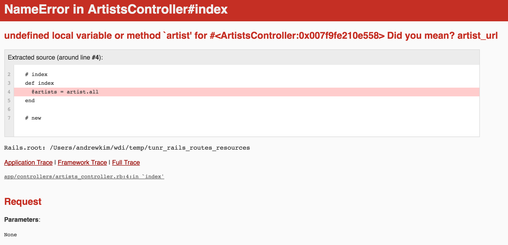

# Effective Written Questions

## Learning Objectives

- Evaluate components of a good question.
- Submit effective questions to github issues/stack overflow.

## Framing
How many times a week do we struggle as developers? Per day? Frequently. It is important to understand that this comes with the job and that we need to learn through these struggles. Sometimes we get stuck though, and that's ok.

As developers, we will have questions. Lots of them. One of the most important skills that we will develop over time, is asking effective questions. Often times, searching for the right question, will lead us the the very answer we seek in the first place.

## The worst
> My (insert programmatic term here) doesn't work. Can you fix it?

### T && T - Discuss the following - 2 minutes
- Why is this a terrible question?
- Without knowing anything about what the actual problem is, Identify 5 things to add to improve this question.

## Not as bad, but still pretty bad
> I got (insert error here). What's wrong?

### T && T - Discuss the following 2 - minutes
- Why is this a terrible question?
- Without knowing anything about what the actual problem is, Identify 5 things to add to improve this question.

There seems to be a trend here.

## Effective question components (PEAR - *not an industry acronym*):

### 1. Problem
The exact issue for the basis of this question.

> I did `_____` and expected `_____` to happen. Instead I got `_____` result

### 2. Environment
- What are we working in?
- Is it jquery? Rails? Angular?
- is it a dependency that's messed up?

### 3. Attempts
- What have we tried?
- Did we get any different results that might be pertinent to help with the questioning?

### 4. Relevant Code/pictures
- part's of the code that are broken
- anything we've attempted and the results of those attempts
- screenshots of errors
- Don't post entire files(unless it's all relevant).
- Add the part of the file that is relevant to the problem.

## Example

> The following error is happening because in the index action for artists we have a lower case `artist.all` and it needs to be upper case. After the image will be the example question.



> Notice that as the questioner, we can see this error, but anyone reading our question won't have access to this image. This is just context for the error in this lesson plan

### Good Question Model

I'm working on a basic Rails app that displays artists and their songs. I was working on the feature to list all of the artists in one view. When I ran into this error in my controller:

```
undefined local variable or method 'artist' for #<ArtistsController:0x007f9fe219e558>
```

I tried to access `http://localhost:3000/artists` which is defined in `config/routes.rb` as:

```ruby
resources :artists
```

But it doesn't even go to a view of just the words `"hello world"`

The code thats highlighted in the error message is in `app/controllers/artists_controller.rb`:

```ruby
def index
  @artists = artist.all
end
```

I tried making `@artist` singular, I also tried changing `index` to `show` but that doesn't seem to be working. Please help!

### PEAR - revisted
Does the above question meet all the criteria for PEAR? Make sure the next time we submit an issue or ask a question to a developer, that it's a PEAR question. It's not in any particular order, but are we hitting all the components of a good question?

## Markdown
Github issues use markdown for their issue system. Stackoverflow uses something similar but not exactly the same. We'll be going over a bit of the github markdown but you can use some of the same things on Stackoverflow. They have their own directions you can see on their site if/when you ask a question.

If you can learn to effectively use markdown, it will help the effectivity of your questioning significantly. Take the above example without markdown formatting niceties.

### Good Question Model not leveraging markdown

I'm working on a basic Rails app that displays artists and their songs. I was working on the feature to list all of the artists in one view. When I ran into this error in my controller:

undefined local variable or method 'artist' for #<ArtistsController:0x007f9fe219e558>

I tried to access http://localhost:3000/artists which is defined in config/routes.rb as:


resources :artists


But it doesn't even go to a view of just the words "hello world"

The code thats highlighted in the error message is in app/controllers/artists_controller.rb:


def index
  @artists = artist.all
end


I tried making @artist singular, I also tried changing index to show but that doesn't seem to be working. Please help!

### Uhh yeah, that's way worse.
Fortunately markdown isn't that complicated. It's very similar to HTML. Here are the basics you need for asking effective questions on github.

### Headers
(\#) are used for headers.
# `# header 1`
## `## header 2`
### `### header 3`
#### `#### header 4`

### Backticks
Use ``backticks(`)`` as delimiters to display code inline. \`Like this\`. It will look `Like this`. Useful for:

- file names
- urls
- bits of code

Use triple ``backticks(```)`` on either end of a code block to display block code.

Like this:

\`\`\`ruby
def index
  @artists = Artist.all
end
\`\`\`

and it will look like this:

```ruby
def index
  @artists = Artist.all
end
```

Useful for:

- large blocks of code

### Closing Thoughts - Community
The dev community is one of the best I've seen ever. That said. They are significantly more prone to helping someone that has done their own due diligence in seeking out an answer. Also, helping others is the best way to grow and cement your own knowledge base which helping to grow that community.
